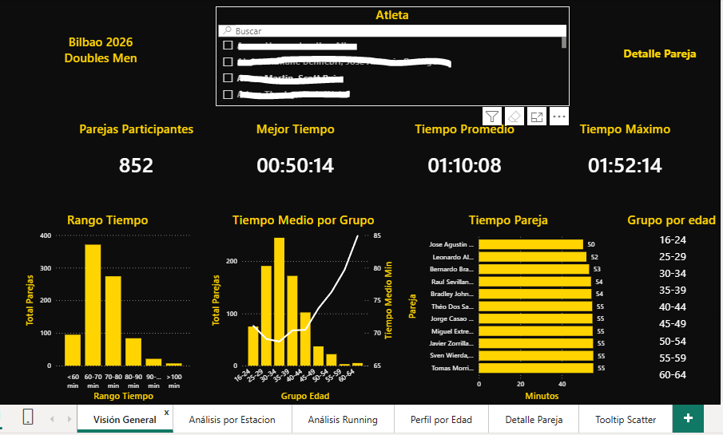
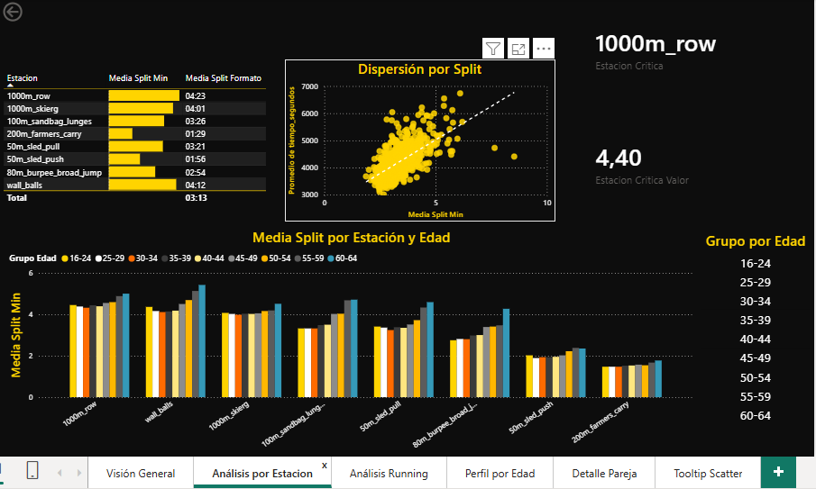
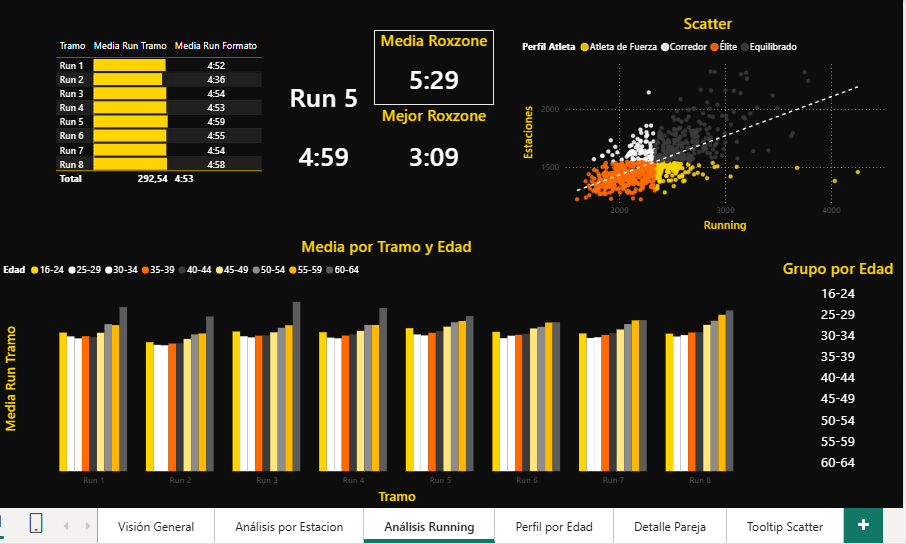
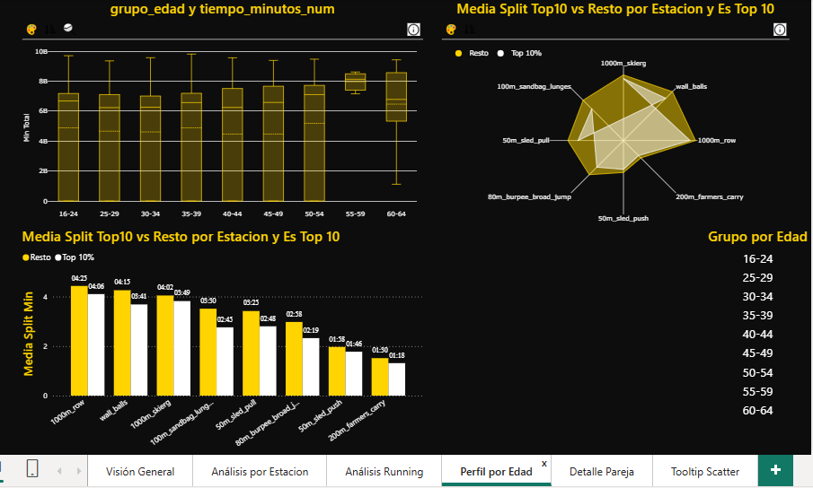
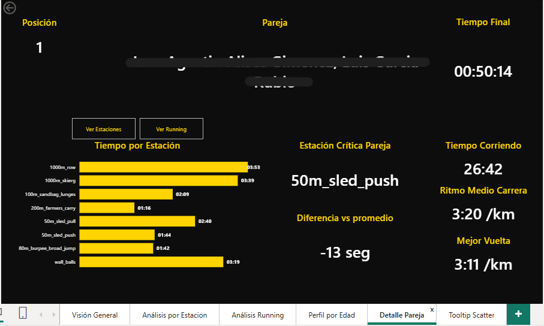

# 🏋️ Hyrox Dobles Bilbao 2026 — Análisis de rendimiento

*(En desarrollo)* Proyecto de Business Intelligence *end-to-end* sobre los resultados de la categoría **Doubles Men** de Hyrox Bilbao 2026: desde la extracción de los datos mediante web scraping hasta un cuadro de mando interactivo en Power BI.



## 📌 Contexto

Hyrox es una competición de fitness en la que cada participante (o pareja, en la modalidad de dobles) completa **8 km de carrera intercalados con 8 estaciones de trabajo funcional**: SkiErg, Sled Push, Sled Pull, Burpee Broad Jumps, Rowing, Farmers Carry, Sandbag Lunges y Wall Balls.

El objetivo del proyecto es responder preguntas como:

- ¿Qué estaciones marcan más diferencia entre las parejas rápidas y las lentas?
- ¿Cómo se distribuye el tiempo total entre carrera y estaciones?
- ¿Cómo varía el rendimiento según el grupo de edad?

## 🔄 Pipeline

```
Web oficial de resultados
        │  Python · BeautifulSoup
        ▼
01_scraping ──► 02_limpieza ──► 03_splits ──► 04_modelo_datos
                                                  │  DuckDB (modelo estrella)
                                                  ▼
                                          Power BI (dashboard)
```

| Etapa | Notebook | Qué hace |
|---|---|---|
| Extracción | `01_scraping.ipynb` | Obtiene los resultados y los tiempos parciales de cada pareja |
| Limpieza | `02_limpieza.ipynb` | Normaliza tipos, formatos de tiempo y categorías, y genera el CSV maestro |
| Splits | `03_splits.ipynb` | Estructura los tiempos por estación y por tramo de carrera |
| Modelado | `04_modelo_datos.ipynb` | Construye el modelo estrella en DuckDB |

**Nota sobre la extracción:** la web de resultados renderiza parte del contenido con JavaScript y bloquea las peticiones automatizadas (errores 403), por lo que el HTML se guardó manualmente y se procesó con BeautifulSoup.

## 🗂️ Modelo de datos

Modelo en estrella construido en DuckDB:

- `fact_resultado`: tabla de hechos con los tiempos de cada pareja
- `dim_atleta`, `dim_categoria`, `dim_evento`: dimensiones
- `v_splits_segundos`: vista con todos los parciales convertidos a segundos

**Dataset final:** 855 parejas y 31 columnas, que incluyen 8 parciales de estación y 8 tramos de carrera.

## 📊 Dashboard

El informe de Power BI tiene cinco páginas con segmentadores sincronizados:

1. **Visión General**: KPIs principales y distribución de tiempos.
2. **Análisis por Estación**: comparación del rendimiento en cada estación mediante gráficos de dispersión y de radar.
3. **Análisis de Running**: ritmos por tramo y evolución a lo largo de los 8 km.
4. **Perfil por Edad**: distribución de tiempos por grupo de edad con diagramas de caja.
5. **Detalle Pareja**: página de *drillthrough* con el desglose completo de una pareja.

| Visión General |
|---|---|
|  |

| Análisis por Estación | Análisis de Running |
|---|---|
|  |  |

| Perfil por Edad | Detalle Pareja |
|---|---|
|  |  |

## 💡 Conclusiones principales

- Comparando todos las parejas y estaciones de fuerza, podemos observar como las estaciones donde más diferencia a unos competidores y otros, la tenemos en los *lunges(zancadas)* donde el top10 promedia 2:45 y el resto 3:30, y en los *burpees*, con un top10 promediando 2:19 y el resto 2:58. Alrededor de 40 segundos de diferencia promedio, que siendo estaciones de fuerza, es notoria, ya que no suele haber tanta diferencia en las estaciones si no más en el running. Esto puede deberse a la gran carga que sufren los cuadriceps en las zancadas, que ya han sufrido 6 estaciones de fuerza y 7km de carrera. Si bien es un ejercicio pesado, el problema es más la carga acumulada que lleva el cuerpo. Por parte de los burpees, se trata de la 4ª estación de fuerza del evento, con 4 km de carga en las piernas. En este momento el cuerpo viene de hacer los dos trineos que son los ejercicios más pesados. Aquí juega el factor de longitud de salto, donde aquellos que sean capaces de completar saltos más largos, por tanto tendrán que realizar menos repeticiones. Cuanto más saltos realizemos, más va a ser tanto el tiempo consumido como la sobrecarga de cuadriceps al levantar todo el cuerpo.

- Podemos observar inequivocamente como el peso que tiene la carrera sobre las estaciones de fuerza es mucho mayor. Ya hemos visto que en los promedios de las estaciones de fuerza, la máxima diferencia está en alrededor de 45 segundos en tan solo una estacion. Mientras en running, los atletas top conservan ritmos maratonianos alrededor de 3:30km durante toda la prueba. Esto son ritmos maratonianos, mientras que el resto de participantes normalmente están(dependiendo del grupo de edad que queramos comparar) entre 4:35km y 5:50km. Sumado a que se repite 8 veces, la mitad de la prueba, podemos entender que es la parte más importante del corredor, ya que va a ser el factor diferencial que nos ponga arriba en el top.

- En cuanto a los grupos de edad y como evoluciona el rendimiento de los atletas. Podemos ver que el pic del rendimiento lo encontramos en los grupos de edad de 30-34(1:08:44) y 25-29 años(1:09:09), habiendo una leve diferencia en favor del primer grupo. El bajón se nota notoriamente en el grupo de 45-49 años, con tiempos promedio de 1:13:46, mientras que destaca que el grupo más joven, de 16-24(1:11:08) también se queda lejos de los grupos de más edad como 35-39(1:10:23) y 40-44(1:10:31). Podemos entender según un estudio sueco de Karolinska Intituet(analizó a participantes durante 47 años y concluyó que la capacidad física máxima general y la resistencia muscular masculina se sitúan entre los 26 y los 35/36 años. A partir de los 35 años, comienza una pérdida paulatina de la potencia que se puede ralentizar significativamente con entrenamientos de fuerza enfocados) que ambos grupos juegan fisicamente en contra, por parte de los jóvenes, que el cuerpo no está completamente desarrollado, y por parte de los mayores, que el cuerpo empieza a notar menos recuperación muscular.  

## ⚙️ Decisiones técnicas

- **Tiempos en dos formatos**: los parciales se guardan como texto `HH:MM:SS` para su visualización, y como segundos enteros (`tiempo_segundos`, Int64) para todos los cálculos.
- **Tabla despivotada**: `splits_largo` (6.840 filas) transforma los parciales de columnas a filas en Power Query para poder analizar las estaciones de forma dinámica.
- **Reproducibilidad**: el parseo de los datos es determinista; se descartó usar un LLM para interpretar cada fila y así garantizar resultados reproducibles.
- **Organización de las medidas**: las métricas principales están agrupadas en una tabla `_Medidas` para facilitar su mantenimiento, mientras que algunas medidas específicas permanecen junto a la tabla sobre la que operan.

## 🛠️ Tecnologías

Python · BeautifulSoup · pandas · DuckDB · SQL · Power BI · Power Query · DAX · Google Colab

## 📁 Estructura del repositorio

```
├── notebooks/   # Pipeline completo, de la extracción al modelo
├── data/        # CSV maestro con los datos limpios
├── powerbi/     # Informe de Power BI (.pbix)
├── img/         # Capturas del dashboard
└── sql/         # Definición del modelo estrella
```

## ▶️ Cómo reproducirlo

Los notebooks están pensados para ejecutarse en **Google Colab** con los datos en Google Drive (`/content/drive/MyDrive/hyrox`). Para abrir el informe basta con descargar el archivo `.pbix` y abrirlo con **Power BI Desktop**.

## Fuentes
- Todos los datos oficiales provienen de la página oficial de Hyorx. https://hyrox.es
- Enlace al estudio **Aumento y disminución de la capacidad física en una población general: un estudio longitudinal de 47 años.** de Karolinka Institutet. https://pmc.ncbi.nlm.nih.gov/articles/PMC12620399/

---

**Autor:** Roberto · [LinkedIn](https://www.linkedin.com/in/roberto-peña-alcaide) · [GitHub](https://github.com/kanteblanco)
